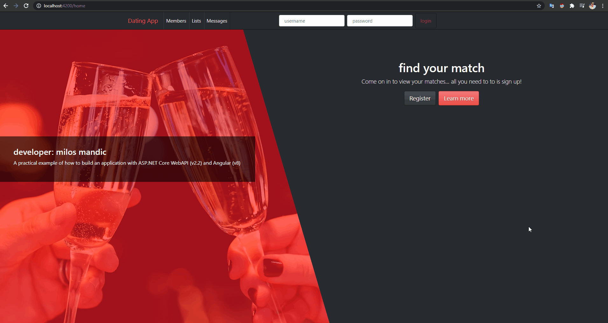
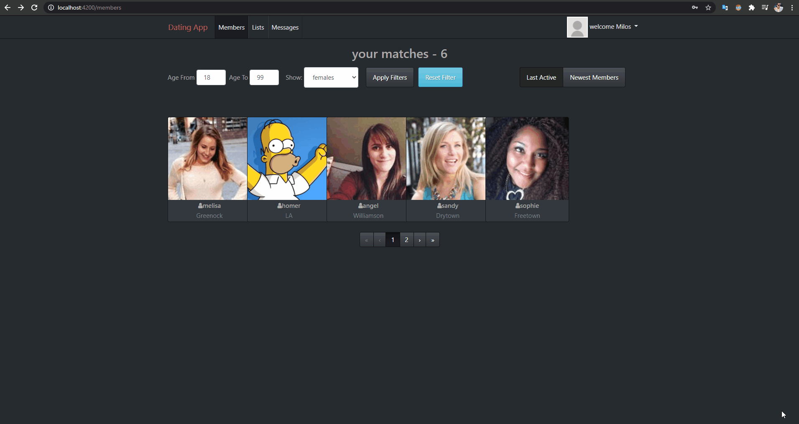
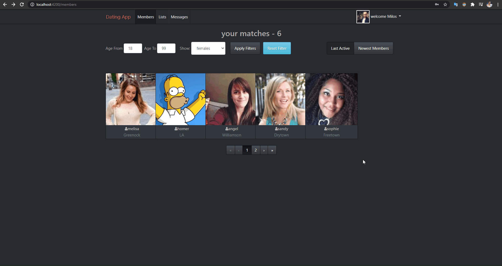
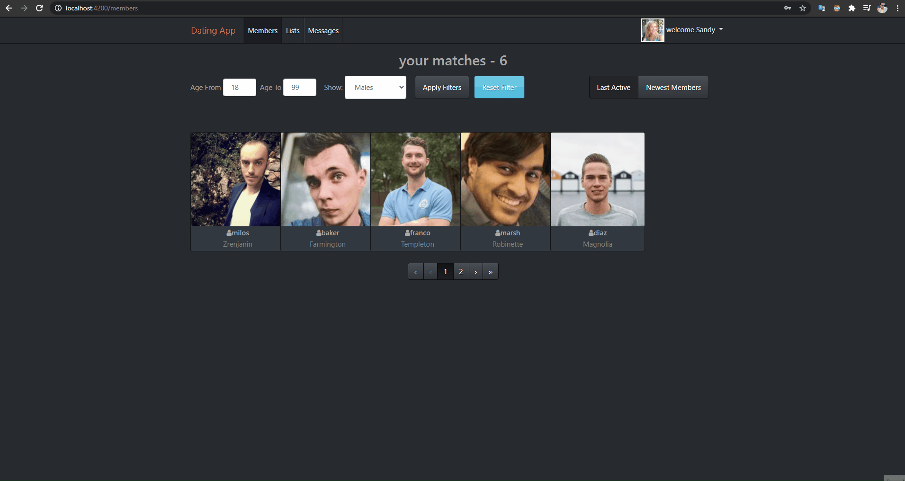

# Angular .NET Core MySQL & Entity Framework - Social Application

<h3>Build an application with ASP.NET Core API 2.2 and Angular 8 from start to finish</h3>

- Setting up the developer environment

- Creating the ASP.NET Core WebAPI and the Angular app using the DotNet CLI and the Angular CLI

- Adding a Client side login and register function to our Angular application

- Adding 3rd party components to add some pizzazz to the app

- Adding routing to the Angular application and securing routes.

- Using Automapper in ASP.NET Core

- Building a great looking UI using Bootstrap

- Adding Photo Upload functionality as well as a cool looking gallery in Angular

- Angular Template forms and Reactive forms and validation

- Paging, Sorting and Filtering

- Adding a Private Messaging system to the app

- Using SignalR for real time presence and live messaging between users

Each user can register:

Every user can edit profile and upload profile picture:

Members can communicate with each other:

On community memebers you can filter by age and gender & like a particular person:

